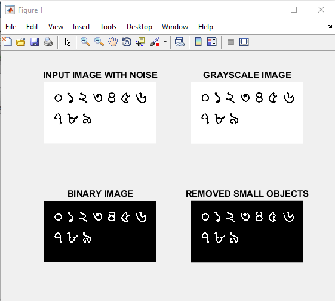
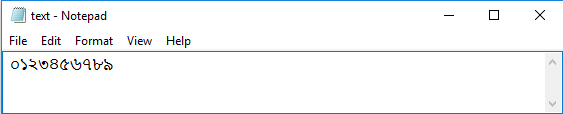

# Bengali-Optical-Digit-Recognition
For a successful optical digit recognition at first, the input image should be processed. That's why the input image is converted into a grayscale image. Then the image is converted to a binary image by the im2bw() function and graythresh() function is used to calculate the threshold from the grayscale image. The bwareaopen() function removes the small objects less than 30 pixels from the binary image. The read_letter(), give_unicode() and internetsoltn() functions are used to recognize the digits by template matching and to write Bengali digits in the notepad.

